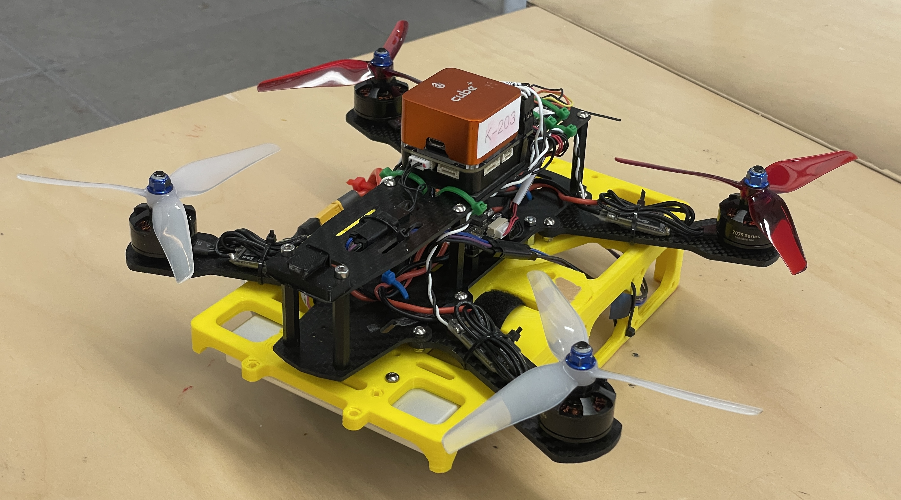
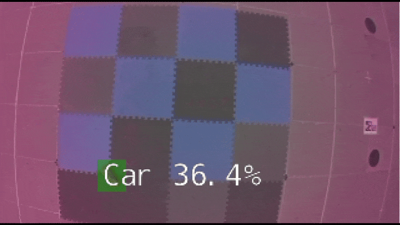
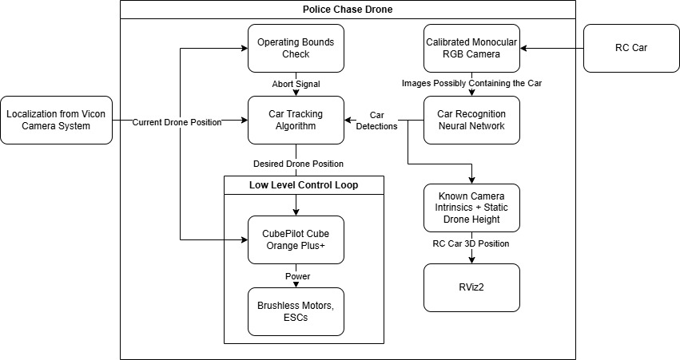
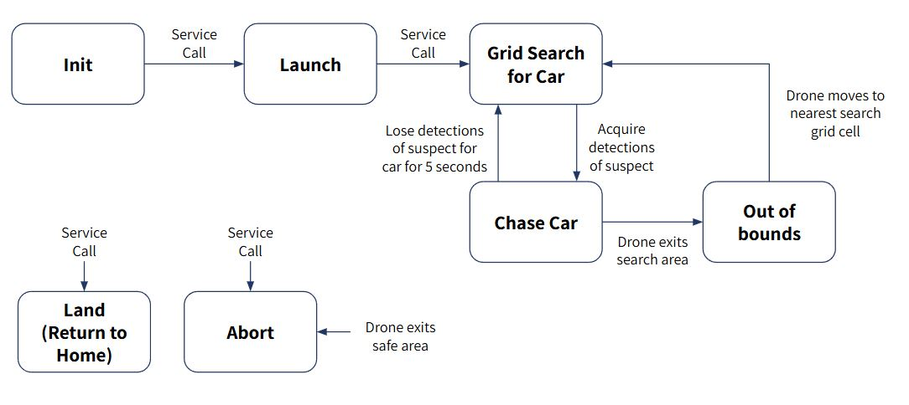
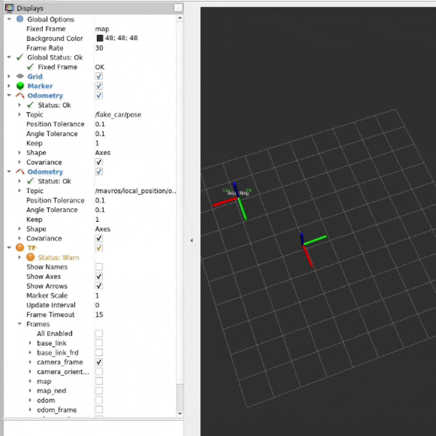

# 🚁 Police Chase Drone - ROB498 Capstone Project



## Overview


This repository contains the final implementation and documentation for our **ROB498 Capstone Design Project** as part of the **Robotics Engineering** undergraduate program at the **University of Toronto**.

Our project, **Police Chase Drone**, showcases the design and development of an autonomous drone system capable of pursuing a dynamic ground target. Leveraging ROS 2 and onboard computation, the drone tracks and follows a "getaway car" through a series of waypoints and behaviors designed to mimic a pursuit scenario.

## Features



- 🔍 **Real-time tracking** of a ground vehicle using onboard sensors and vision using a custom MobileSSD-Net
- 🧠 **Autonomous navigation** with waypoint following and obstacle avoidance
- 📡 **ROS 2-based modular software stack** for sensor integration and control
- 🛸 **Custom flight behaviors** to simulate realistic police drone pursuits

## System Overview



The software system is built in ROS 2 using a set of nodes that handle:

- Perception: Camera input, object detection, and tracking
- Planning: Waypoint generation and trajectory tracking using a state machine
- Control: Velocity and position control for the drone

Here's the state machine diagram that outlines the drone's behavior:



And here is it in action in the simulation:




## Installation

1. Clone the repository:
```bash
git clone https://github.com/Alex-Alexiev/drone-dogs.git
cd src
```

2. Build the workspace:
```bash
cd perception_msgs
colcon build
source install/setup.bash

cd ../px4_autonomy_modules
colcon build
source install/setup.bash
```

## Usage

To launch the Rviz2 'simulation' environment:
```bash
./test.sh
```

For hardware-in-the-loop testing:
```bash
./run.sh
```

## Hardware Used

* **NVIDIA Jetson Nano** for onboard computation
* **IMX219 Color Camera**
* **Orange Cube+ PX4-compatible flight controller**
* **Battery-powered quadcopter frame**
* **Wi-Fi telemetry and ground station**

## Team Members


This project was completed by:

* Kevin Angers
* Chris Adolphe
* Alexander Alexiev
* John Wolf

Supervised as part of the **ROB498 Capstone Design Project** at the **University of Toronto**.

## Acknowledgments

We thank Professor Waslander and the teaching assistants staff for their guidance and support throughout this project, as well as the sample code [found here](https://github.com/utiasSTARS/ROB498-flight).
Special thanks to [dusty-nv](https://github.com/dusty-nv) for the [Jetson Inference](https://github.com/dusty-nv/jetson-inference) and [ROS Deep Learning](https://github.com/dusty-nv/ros_deep_learning) repositories, which provided invaluable resources for our computer vision tasks.

## License

This project is licensed under the [MIT License](LICENSE).
